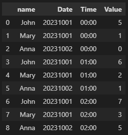
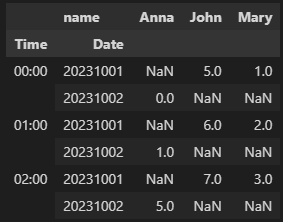
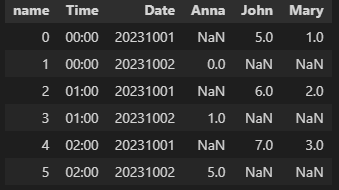
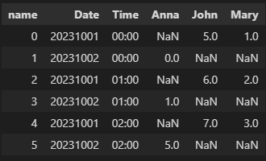
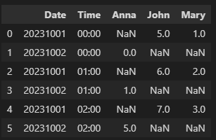
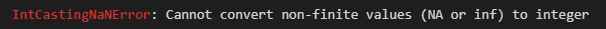
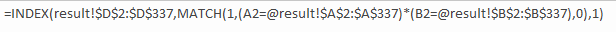

# Contents
[1. Pass argument to Python from command line](#1)  
[2. CVS Reader](#2)  
[3. Web Scraping With Selenium](#3)  
[4. Convert Rows To Columns And Columns To Rows](#4)  
[5. Pandas: convert numerical column (with NA) to integer data type](#5)  
[6. Delete files older than N days](#6)   
[7. Call SAP from Python, R, VBS](#7)  
[8. Encrypt Excel](#8)

<p id = "1"></p>

# 1. Pass argument to Python from command line
Sometimes user input is needed during programme running process. Though we can achieve it simply from Python terminal, I need to do it from command line somehow. The advantage is that multiple types of programmes (including Python, R, VBS) can be run through one double-click (.bat file), rather than run each programme one by one.
### Step 1: Prepare Python file to get argument
```py
import sys

a = sys.argv[1]
b = sys.argv[2]
print('I got a:' + str(a))
print('I got b:' + str(b))
```

### Step 2: Prepare a .bat file to pass arguments and run Python file
```
@echo off
set /p a=First argument:
set /p b=Second argument:

python "python path.py" %a% %b%
pause
```
<p id = "2"></p>

# 2. CSV reader
The CSV file is opened as a text file with Python's built-in open() function, which returns a file object. This is then passed to the reader, which does the heavy lifting.
```python
import csv

with open('employee_birthday.csv') as csv_file:
    csv_reader = csv.reader(csv_file, delimiter=',')

# csv_reader is a reader object
csv_reader
```
csv_reader would return a reader object, which looks like this:
```
<_csv.reader at 0x2011be5ef20>
```

Must do the operation inside with open, or error would occur:
```py
for row in csv_reader:
    print(row)
```


The right codes are:
```py
with open('employee_birthday.csv') as csv_file:
    csv_reader = csv.reader(csv_file, delimiter=',')
    for row in csv_reader:
        print(row)
```
Each row would be printed out inside a list.
```
['name', 'department', 'birthday month']
['John Smith', 'Accounting', 'November']
['Erica Meyers', 'IT', 'March']
```

Then how can we count the number of rows, print out column names and print fields of a row without list bracket?
```py
fields = []
rows = []

# Open CSV file in READ mode. The file object is names as csv_file, then the file object is converted to csv.reader object, which is saved in csv_reader.
with open('employee_birthday.csv', 'r') as csv_file:
    csv_reader = csv.reader(csv_file, delimiter=',')
    # csv_reader is an iterable object, next() returns the current row and advances the iterator to the next row. The first row of the csv file contains the headers, we save them in a list called fields
    fields = next(csv_reader)

    # Now we iterate through the remaining rows using a for loop. Each row is saved to a list.
    for row in csv_reader:
        rows.append(row)
    
    # line_num is a counter which returns the number of rows that have benn iterated
    # The number of rows includes header
    print("Total number of rows: %d" %(csv_reader.line_num))

print("Field names are: " + ", ".join(field for field in fields))

print('\nFirst 2 rows are:\n')
for row in rows[:2]:
    print(row)
    for col in row:
        print(col, end="    ")
    print('\n')
```
<p id = "3"></p>

# 3. Web scraping with selenium
Sometimes we need to scrape webpages and store some information into dataframes. One way to achieve this goal is using selenium, which is a built-in package of Python.
Let's use [Hacker News](https://news.ycombinator.com/) as an example. I want to scrape articles' titles and source links, then save them into a dataframe. Here is how I did it.
### Step 1: Import necessary libraries and access webdriver.
```py
from selenium import webdriver
from selenium.webdriver.common.keys import Keys
from selenium.webdriver.common.by import By
import pandas as pd

# Download webdriver according to your browser
service = webdriver.EdgeService(executable_path=r"C:\\Users\\16C7656\\Documents\\webdriver\\msedgedriver.exe")
driver = webdriver.Edge(service=service)
```

### Step 2: Access target website
```py
driver.get('https://news.ycombinator.com/')
```

### Step 3: Locate title elements and save them into a list
```py
titles = driver.find_elements(By.XPATH,'//span[@class="titleline"]/a[1]')

title_list = []

for p in range(len(titles)):
    title_list.append(titles[p].text)

```

### Step 4: Locate link elements according to titles
```py

link_list = []

for i in range(0,len(title_list)):
    title_name = title_list[i]

    if '"' in title_name:
        xpath = "//*[text()='{}']/..//span[@class='sitestr']".format(title_name)
    elif "'" in title_name:
        xpath = "//*[text()=\"{}\"]/..//span[@class='sitestr']".format(title_name)
    else:
        xpath = "//*[text()='{}']/..//span[@class='sitestr']".format(title_name)

    link = driver.find_elements(By.XPATH,xpath)

    if link:
        link_list.append(link[0].text)
    else:
        link_list.append("Null")
```

### Step 5: Convert lists into dataframe
```py
data_tuples = list(zip(title_list[0:],link_list[0:])) 
df = pd.DataFrame(data_tuples, columns=['Title','Link'])
```
<p id = "4"></p>

# 4. Convert rows to columns and columns to rows
From time to time, we need to showcase information through different table formats. Sometimes, I want to convert values into headers, and sometimes, I feel like converting headers into values. This conversion involves pivot and melt function, we'd better understand and apply them flexibly to help us present data in a better way.

Before we start, I wanna give a brief summary of what pivot and melt function do. To simply put it, melt function is used to change dataframe from wide to long, while pivot function is the opposite, and it helps to unmelt.

We all know what pivot table in Excel does, so it is easy to understand these two functions.

Let's use a dataframe as example:

### Step 1: Create a dataframe
```py
import pandas as pd

df=pd.DataFrame([['John','20231001',5,6,7],['Mary','20231001',1,2,3],['Anna','20231002',0,1,5]],columns=['name','Date','00:00','01:00', '02:00'])
```

Here is the dataframe. What I want to achieve is add an extra time column, and convert names to headers.


### Step 2: Melt dataframe to convert time header to values
```py
melted_df = df.melt(id_vars=['name', 'Date'], var_name='Time', value_name='Value')
```

Now time headers become a seperate column, with them being values.



### Step 3: Convert names into headers using pivot() method
```py
transposed_df = melted_df.pivot(index=['Time', 'Date'], columns='name', values='Value')
```
Now "name" column is converted to headers. It is unmelted.  




### Step 4: Reset index
```py
transposed_df = transposed_df.reset_index()
```



### Step 5: Reorder columns
It would be better to put "Date" column before "Time" column. So let's reorder.

```py
transposed_df = transposed_df[['Date', 'Time'] + list(transposed_df.columns[2:])]
```



### Step 6: Rename index
No need to name index column as "name", so we need to rename it.
```py
transposed_df = transposed_df.rename_axis(None, axis=1)
```


### Step 7: Sort by "Date" and "Time"
```py
transposed_df = transposed_df.sort_values(['Date','Time'])
```


<p id = "5"></p>

# 5. Pandas: convert numerical column (with NA) to integer data type
This is a common step of data manipulation, which seems easy. However, I ran into an error once, saying that "cannot convert NA to integer". This situation would occur if there exist NA values in the conlumn which requires data type conversion.

Here is an example.

### Step 1: Create a simple data frame
This data frame has no meaning at all :) Column "Number" should be integer data type, but somehow the values are decimal numbers. Please note that 
there is a missing value.

```py
import pandas as pd

df=pd.DataFrame([['John',7.0],['Mary',3.0],['Anna',5.0],['Tom',]],columns=['Name','Number'])
```


### Step 2: Convert column data type from float to integer
**Wrong:**
```py
df['Number'] = df['Number'].astype("int")
df['Number'] = df['Number'].astype("int64")
```

Error would occur after this step.



**Correct:**
```py
df['Number'] = df['Number'].astype("Int64")
```

Now the data frame is successfully converted.  


Reason: **Pandas primarily uses NaN to represent missing data, and it is a float.** Therefore, this forces an array of integers with even one missing value to become floating point.
Pandas can represent integer data with possibly missing values using arrays.IntegerArray.

<p id = "6"></p>

# 6. Delete files older than N days
This action is always required when it comes to house keeping. Nothing to say here, just share codes below.

### Scenario 1: delete files based on file creation time
```py
import os
from datetime import datetime
import glob

source_folder = r"your folder path" # remember to add "\\" in the end

# delete file by ctime
today = datetime.now()

all_files = glob.glob(source_folder + "*.csv")

for f in all_files:
    file_path = os.path.join(source_folder,f)
    file_time = os.path.getctime(file_path)
    file_date = datetime.fromtimestamp(file_time)
    day_gap = (today-file_date).days

    if day_gap > 30:
        os.remove(file_path)
```

### Scenario 2: delete files based on the date string in file name
```py

import os
from datetime import datetime
import glob

source_folder = r"your folder path" # remember to add "\\" in the end

today = today.date()

for f in all_files:
    file_path = os.path.join(source_folder,f)

    basename = os.path.basename(f).split('/')[-1]

    # slicing is based on your filename format
    file_date = basename[-18:-10]
   
    file_date = datetime.strptime(file_date,'%Y%m%d').date()
    day_gap = today - file_date
    days = day_gap.days

    if days < 2:
         os.remove(file_path)
```

<p id = "7"></p>

# 7. Call SAP from Python, R, VBS
Though VBS is a little bit outdated, sometimes I still need to use it, mainly for calling SAP. My main programme tools are python and R, so integrating vbs to python/R is super important.

For VBS script, we can record scripts in SAP. But in order to run the script successfully, extra codes are needed.

VBS scripts are as follows:
```vb
' Extra codes
Set WSHShell = CreateObject("WScript.Shell")

SAPGUIPath = "C:\Program Files (x86)\SAP\FrontEnd\SAPgui\"
Name = """CCMS UP2  Production IS-UT 6.08"""
SID = "UP2"
'Name = """CCMS UQ4  Quality Assurance IS-UT 6.08"""
'SID = "UQ4"
InstanceNo = "01"

errCounter = 0
errCounter_2 = 0
    
Do

	On Error Resume Next
	err.number = 0
	WScript.Sleep 1000
	errCounter = errCounter + 1

    Set SapGuiAuto = GetObject("SAPGUI")
    Set SAPGuiApp = SapGuiAuto.GetScriptingEngine
    Set Connection = SAPGuiApp.Children(0)
    Set session = Connection.Children(0)
	
	If err.number = 0 Then
		pos_lookFor = InStr(1, session.ActiveWindow.Children.Item(1).Children.Item(3).Text, "the network", 1)
		If (pos_lookFor > 0 And session.ActiveWindow.Name = "wnd[1]") Then
        	session.findById("wnd[1]/tbar[0]/btn[0]").press
    	End If
		If session.ActiveWindow.Name = "wnd[0]" Then Exit Do
	Else
		If errCounter <= 1 Then
			WSHShell.Exec SAPGUIPath & "sapgui.exe " & Name & " " & InstanceNo
			Set WSHShell = Nothing
		End If
	End If

Loop While (errCounter <= 7)

'scripts recorded from SAP
strUser = CreateObject("WScript.Network").UserName
outputLocation = "xxx"
fileName = "xxx"

session.findById("wnd[0]").maximize
session.findById("wnd[0]/tbar[0]/okcd").text = "tcode"
session.findById("wnd[0]").sendVKey 0
session.findById("wnd[0]/usr/ctxtS_VDAY-LOW").text = Day(Date-7) & "." & Month(Date-7) & "." & Year(Date-7)
session.findById("wnd[0]/usr/ctxtS_VDAY-HIGH").text = Day(Date-1) & "." & Month(Date-1) & "." & Year(Date-1)
session.findById("wnd[0]/usr/ctxtS_VDAY-HIGH").setFocus
session.findById("wnd[0]/usr/ctxtS_VDAY-HIGH").caretPosition = 10
session.findById("wnd[0]/usr/btn%_S_PROF_%_APP_%-VALU_PUSH").press
session.findById("wnd[1]/tbar[0]/btn[16]").press
session.findById("wnd[1]/tbar[0]/btn[16]").press
session.findById("wnd[1]/tbar[0]/btn[24]").press
session.findById("wnd[1]/tbar[0]/btn[8]").press
session.findById("wnd[0]/tbar[1]/btn[8]").press
session.findById("wnd[0]/tbar[1]/btn[46]").press
session.findById("wnd[0]/tbar[1]/btn[43]").press
session.findById("wnd[1]/tbar[0]/btn[0]").press
session.findById("wnd[1]/tbar[0]/btn[0]").press
session.findById("wnd[1]/usr/ctxtDY_PATH").text = outputLocation
session.findById("wnd[1]/usr/ctxtDY_FILENAME").text = fileName
session.findById("wnd[1]/usr/ctxtDY_FILENAME").caretPosition = 7
session.findById("wnd[1]/tbar[0]/btn[0]").press
session.findById("wnd[0]/tbar[0]/btn[12]").press
session.findById("wnd[0]/tbar[0]/btn[12]").press
session.findById("wnd[0]/tbar[0]/btn[12]").press
```

Above codes would be saved in a vbs file, which can be directly called from R or Python. Let's say the vbs file name is **test.vbs**, then the programmes can work this way:

```R
pathofvbscript = "C:/test.vbs"
shell(shQuote(normalizePath(pathofvbscript)), "cscript", flag = "//nologo")
```

```py
vbscript_file = r"C:\\test.vbs"
output = subprocess.check_output(['cscript.exe', '//nologo', vbscript_file], universal_newlines=True)
```

What if we don't want to call another programme inside, but instead would like to integrate it. I've only figured out the way to do it with python and excel VBA.

Codes will also be uploaded.

VBA codes:
```vb
Sub sapLoop()

Dim sap_session As Object
Set sap_session = declareSAP

With sap_session
    .findById("wnd[0]/tbar[0]/okcd").Text = "your tcode"
    'SAP codes
End With

End Sub


Function declareSAP() As Object

On Error GoTo Err_NoSAP
Set WSHShell = CreateObject("WScript.Shell")

AnnoyingPopUpWinTitle = "SAP"
TargetWinTitle = "SAP Easy Access"
SAPGUIPath = "C:\Program Files (x86)\SAP\FrontEnd\SAPgui\"
Name = """CCMS UP2  Production IS-UT 6.08"""
SID = "UP2"
'Name = """CCMS UQ4  Quality Assurance IS-UT 6.08"""
'SID = "UQ4"
InstanceNo = "01"

If IsObject(WSHShell) Then

    WSHShell.Exec SAPGUIPath & "sapgui.exe " & Name & " " & InstanceNo
    Set WSHShell = Nothing
    
End If

On Error GoTo waiting_SAP

    counter = 0
    
    Do
nextLoop:
        Application.Wait (Now + TimeValue("00:00:01"))
        counter = counter + 1
        If counter > 7 Then GoTo Err_NoSAP
        Set SapGuiAuto = GetObject("SAPGUI")
        Set SAPGuiApp = SapGuiAuto.GetScriptingEngine
        Set Connection = SAPGuiApp.Children(0)
        Set sap_session = Connection.Children(0)
        
        On Error Resume Next
        pos_lookFor = InStr(1, sap_session.ActiveWindow.Children.Item(1).Children.Item(3).Text, "the network", 1)
        pos_lookFor_2 = InStr(1, sap_session.findById("/app/con[0]/ses[0]/wnd[1]/usr/sub/1[0,0]/sub/1/2[0,2]/lbl[0,2]").rowtext, "the network", 1)
        On Error GoTo 0
        
        If ((pos_lookFor > 0 Or pos_lookFor_2 > 0) And sap_session.ActiveWindow.Name = "wnd[1]") Then
            sap_session.findById("wnd[1]/tbar[0]/btn[0]").press
        End If
        
    Loop While sap_session.ActiveWindow.Name <> "wnd[0]"

On Error GoTo 0

On Error GoTo 0

If (Connection.Children.Count > 1) Then GoTo Err_TooManySAP

Set declareSAP = sap_session

Exit Function

Err_TooManySAP:
MsgBox "More than one SAP session is identified. Please open only one SAP session."
End

Err_NoSAP:
MsgBox "Failed to launch SAP"
End

waiting_SAP:
Resume nextLoop

End Function
```

Python code can only work when SAP and tcode are both open or closed.
```python
import sys
import win32com.client
import subprocess
import time
import os

# Check a process is running
def process_exists(process_name):   
    call = 'TASKLIST', '/FI', 'imagename eq %s' % process_name
    # use buildin check_output right away
    output = subprocess.check_output(call).decode()
    # check in last line for process name
    last_line = output.strip().split('\r\n')[-1]
    # because Fail message could be translated
    return last_line.lower().startswith(process_name.lower())

# If SAP is not opened, then open SAP
if not process_exists("saplogon.exe"):
    subprocess.call(r'"C:\Program Files (x86)\SAP\FrontEnd\SAPgui\sapshcut.exe" -system=UP2 -client=100')
    time.sleep(5)

try:

    SapGuiAuto = win32com.client.GetObject("SAPGUI")
    if not type(SapGuiAuto) == win32com.client.CDispatch:
        exit()

    application = SapGuiAuto.GetScriptingEngine
    if not type(application) == win32com.client.CDispatch:
        SapGuiAuto = None
        exit()

    connection = application.Children(0)
    if not type(connection) == win32com.client.CDispatch:
        application = None
        SapGuiAuto = None
        exit()

    session = connection.Children(0)
    if not type(session) == win32com.client.CDispatch:
        connection = None
        application = None
        SapGuiAuto = None
        exit()
        

    try:
        if session.findById("wnd[1]"):
            session.findById("wnd[1]").sendVKey(0)
    except:
        pass

    # vbs code
    session.findById("wnd[0]").maximize()
    session.findById("wnd[0]/tbar[0]/okcd").text = "tcode"
    session.findById("wnd[0]").sendVKey(0)
    session.findById("wnd[0]/usr/btn%PS06004_1000").press()
    session.findById("wnd[0]/usr/ctxtSEL_DEV-LOW").text = "xxxx"
    session.findById("wnd[0]/usr/ctxtSEL_DEV-LOW").caretPosition = 7
    session.findById("wnd[0]/usr/btn%PS33072_1000").press()
    session.findById("wnd[0]/tbar[1]/btn[8]").press()  
    session.findById("wnd[0]/usr/cntlBCALVC_EVENT2_D100_C1/shellcont/shell").pressToolbarContextButton("&MB_EXPORT")
    session.findById("wnd[0]/usr/cntlBCALVC_EVENT2_D100_C1/shellcont/shell").selectContextMenuItem("&XXL")
    session.findById("wnd[1]/tbar[0]/btn[0]").press()
    session.findById("wnd[1]/usr/ctxtDY_PATH").text = "c:\\temp"
    session.findById("wnd[1]/usr/ctxtDY_FILENAME").text = "EXPORT.XLSX"
    session.findById("wnd[1]/usr/ctxtDY_FILENAME").caretPosition = 11
    session.findById("wnd[1]/tbar[0]/btn[0]").press()

except Exception as e:
    print(sys.exc_info()[0])

finally:
    session = None
    connection = None
    application = None
    SapGuiAuto = None
```
<p id = "8"></p>

# 8. Encrypt Excel
Python can help encrypt excel files. 
```python
import xlwings as xw

app = xw.App(visible=True,add_book=False)
wb = app.books.open(filepath)
wb.api.Password = 'xxxx'
wb.save()
wb.close()
app.quit()
```

# 9. Generate variables with consecutive numbers in names
I have a data frame, and I want to save every 200 rows into a separate data frame. Previously I did it in a tedious way:

```python
df_1 = df[0:199]
df_2 = df[200:399]
```

But there is a better way to achieve this:
```python
n = 200   # Number of meter to split per file
N = math.ceil(len(df) / n)
d = {}

for i in range(1,N+1):
    d["df_{}".format(i)] = df[n*(i-1):n*i]
```

Currently I can only put data frames into a dictionary, with data frame names as keys and data frames as values.

# 10. Print elements from two lists in pairs
There are two lists, and I want to print elements in pairs (i.e. print the first elements from two lists together, and then second... ) in html format.
```python
list1 = ["Anna","Bob","Cindy"]
list2 = [1,2,3]
pair_string = '<br>'.join(f'{item1} {item2}' for item1,item2 in zip(list_1,list2))
```

# 11. formula array
When using xlwings to manipulate excel, I found that inserting formula with multiple sheet names always caused error. "@" would be automatically added in front of sheet names.  



The codes are:
```python
ws.range('C2').formula="=INDEX('result'!$D$2:$D$337,MATCH(1,(A2='result'!$A$2:$A$337)*(B2='result'!$B$2:$B$337),0),1)"
```

I searched a lot and found a way to avoid "@":
```python
ws.range('C2').formula_array="=INDEX('result'!$D$2:$D$337,MATCH(1,(A2='result'!$A$2:$A$337)*(B2='result'!$B$2:$B$337),0),1)"
```

I haven't figured out the reason though.

# 12. list comprehension


# 13. copy excel to email

